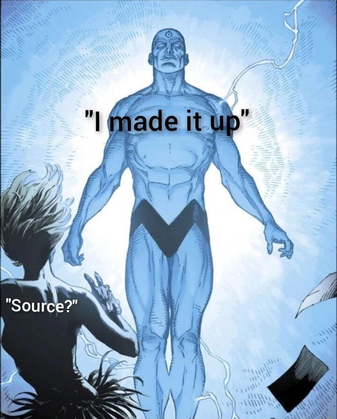

# odin-calculator
<b><b>Link:<b> https://vozkingdom.github.io/odin-calculator/

<h4>minor bugs to fix</h5> 
<ul>
    <li>make css prettier</li>
    <li>limit long decimal answers to prevent screen overflow</li>
    <li>refactor code. convert if..else conditionals (in `DIRECTORY` function) to seperate functions. one function for one action.</li>
    <li>implement 'Backspace' feature. 'Del' works adequately rn</li>
</ul>

<h3>Source:</h3> 
    
     *** Let <b><em>Thy Will</b> </em> Be Done ***

<h3>Project:</h3> 
    Calculator.   

<h3>Goal:</h3>
    Build a Calculator. 

<h3>Message to the Future:</h3>

 
 <em>I <b>CREDUNT</b> in you</em> ❤️‍🔥

 __<em><b>ascend</b></em> __ (only a matter of time)

 <b>___ Y O U _ G O T _ T H I S ___</b>

 <b>___ I  _ G O T _ Y O U R _ B A C K ___ (ALWAYS WILL ❤️‍🔥 ~ #4L)</b>
